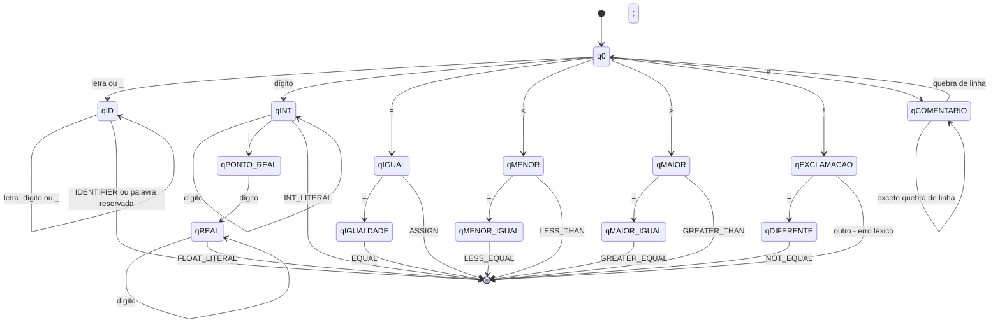

# AFD do analisador léxico

Este documento descreve o Autômato Finito Determinístico (AFD) usado como referência para o lexer da MiniLang. Ele corresponde ao comportamento implementado em `minilang/lexer/lexer.go` e registra separadamente as limitações atuais.

## Funcionamento geral

O analisador começa no estado `q0` e aplica a regra do **maior prefixo válido**: consome caracteres enquanto existe uma transição possível e, ao alcançar o fim do lexema, emite o token associado ao último estado de aceitação. Depois, retorna a `q0` para reconhecer o próximo token.

Espaços, tabulações e retornos de carro são descartados. Uma quebra de linha também é descartada, mas incrementa a linha e reinicia a coluna. No fim da entrada, o lexer emite `EOF`.

Para identificadores, a aceitação em `qID` é seguida por uma consulta à tabela `Keywords`. Assim, um lexema como `while` gera `WHILE`, enquanto um lexema que não consta nessa tabela gera `IDENTIFIER`.

## Diagrama de estados

O diagrama destaca os reconhecimentos que usam mais de um caractere. Operadores e delimitadores de um único caractere são apresentados na tabela de transição.

`qPONTO_REAL`, `qEXCLAMACAO` e `qCOMENTARIO` não são estados de aceitação. Para números, se o ponto não for seguido de um dígito, o último estado aceito é `qINT`; o ponto fica para o próximo reconhecimento e gera `DOT`. No código atual, esse comportamento é feito por antecipação com `peekNextIsDigit()`.

## Classes de caracteres

| Classe | Definição usada pelo lexer |
| --- | --- |
| `letra` | `a`–`z`, `A`–`Z`, `_`, `ã` ou `Ã` |
| `dígito` | `0`–`9` |
| `alfanumérico` | `letra` ou `dígito` |
| `branco` | espaço, tabulação ou retorno de carro |
| `quebra de linha` | `\n` |

O sublinhado faz parte da classe `letra` na implementação. Portanto, pode iniciar ou continuar um identificador.

## Tabela de transição

Na tabela, “emitir” encerra o lexema atual e reinicia o reconhecimento em `q0`. Quando o próximo caractere não pertence ao lexema, ele não é consumido e será analisado a partir de `q0`.

| Estado atual | Entrada | Próximo estado ou ação | Token/efeito |
| --- | --- | --- | --- |
| `q0` | `letra` | `qID` | — |
| `qID` | `alfanumérico` | `qID` | — |
| `qID` | outro ou fim da entrada | emitir | Palavra reservada ou `IDENTIFIER` |
| `q0` | `dígito` | `qINT` | — |
| `qINT` | `dígito` | `qINT` | — |
| `qINT` | `.` | `qPONTO_REAL` | — |
| `qPONTO_REAL` | `dígito` | `qREAL` | — |
| `qPONTO_REAL` | outro ou fim da entrada | retornar ao último estado aceito | Emitir `INT_LITERAL` e reprocessar `.` como `DOT` |
| `qREAL` | `dígito` | `qREAL` | — |
| `qINT` | outro ou fim da entrada | emitir | `INT_LITERAL` |
| `qREAL` | outro ou fim da entrada | emitir | `FLOAT_LITERAL` |
| `q0` | `=` | `qIGUAL` | — |
| `qIGUAL` | `=` | emitir | `EQUAL` |
| `qIGUAL` | outro ou fim da entrada | emitir | `ASSIGN` |
| `q0` | `<` | `qMENOR` | — |
| `qMENOR` | `=` | emitir | `LESS_EQUAL` |
| `qMENOR` | outro ou fim da entrada | emitir | `LESS_THAN` |
| `q0` | `>` | `qMAIOR` | — |
| `qMAIOR` | `=` | emitir | `GREATER_EQUAL` |
| `qMAIOR` | outro ou fim da entrada | emitir | `GREATER_THAN` |
| `q0` | `!` | `qEXCLAMACAO` | — |
| `qEXCLAMACAO` | `=` | emitir | `NOT_EQUAL` |
| `qEXCLAMACAO` | outro ou fim da entrada | informar erro léxico | Caractere `!` não reconhecido |
| `q0` | `+` | emitir | `PLUS` |
| `q0` | `-` | emitir | `MINUS` |
| `q0` | `*` | emitir | `MULTIPLY` |
| `q0` | `/` | emitir | `DIVIDE` |
| `q0` | `%` | emitir | `PERCENT` |
| `q0` | `(` | emitir | `LEFT_PAREN` |
| `q0` | `)` | emitir | `RIGHT_PAREN` |
| `q0` | `{` | emitir | `LEFT_BRACE` |
| `q0` | `}` | emitir | `RIGHT_BRACE` |
| `q0` | `;` | emitir | `SEMICOLON` |
| `q0` | `:` | emitir | `COLON` |
| `q0` | `,` | emitir | `COMMA` |
| `q0` | `.` | emitir | `DOT` |
| `q0` | `#` | `qCOMENTARIO` | Iniciar comentário |
| `qCOMENTARIO` | caractere diferente de `\n` | `qCOMENTARIO` | Descartar caractere |
| `qCOMENTARIO` | `\n` ou fim da entrada | `q0` ou finalizar | Descartar comentário |
| `q0` | `branco` | permanecer em `q0` | Descartar caractere |
| `q0` | `quebra de linha` | permanecer em `q0` | Incrementar linha e reiniciar coluna |
| `q0` | outro caractere | permanecer em `q0` | Informar erro léxico |
| `q0` | fim da entrada | finalizar | `EOF` |

Comentários usam exclusivamente `#` e continuam até a quebra de linha ou o fim do arquivo. A sequência `//` não inicia comentário: ela representa dois tokens `DIVIDE`.

## Palavras reservadas

Depois de reconhecer um identificador, o lexer consulta a seguinte tabela:

| Lexema | Token | Lexema | Token |
| --- | --- | --- | --- |
| `program` | `PROGRAM` | `var` | `VAR` |
| `int` | `TYPE_INT` | `float` | `TYPE_FLOAT` |
| `boolean` | `TYPE_BOOL` | `if` | `IF` |
| `else` | `ELSE` | `while` | `WHILE` |
| `print` | `PRINT` | `read` | `READ` |
| `true` | `TRUE` | `false` | `FALSE` |
| `and` | `AND` | `or` | `OR` |
| `not` | `NOT` | `end` | `END` |

Essa consulta diferencia letras maiúsculas de minúsculas. As palavras em português apresentadas na especificação do projeto ainda não são reconhecidas como palavras reservadas.

## Estados de aceitação

| Estado | Categoria aceita |
| --- | --- |
| `qID` | Identificador ou palavra reservada |
| `qINT` | Literal inteiro (`INT_LITERAL`) |
| `qREAL` | Literal real |
| `qIGUAL` | Atribuição |
| `qIGUALDADE` | Igualdade |
| `qMENOR` | Menor que |
| `qMENOR_IGUAL` | Menor ou igual |
| `qMAIOR` | Maior que |
| `qMAIOR_IGUAL` | Maior ou igual |
| `qDIFERENTE` | Diferente |
| Estados unitários | Operadores aritméticos e delimitadores |

